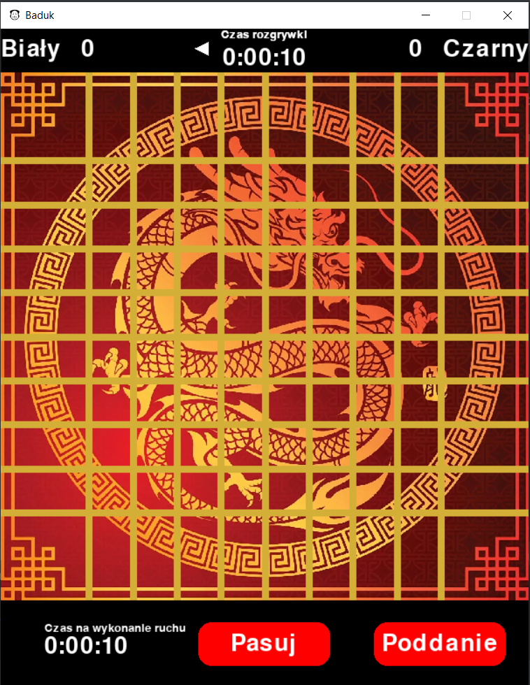

# Baduk

## Opis
Repozytorium ukazuje naszą implementacje najstarszej gry planszowej nazywanej "go" lub "baduk".
Tak wygląda plansza: 

## Użyte technologie
- python 3.10
- pygame
- tkinter

## Pierwsze użycie
1. Zainstalowanie najnowszej wersji pythona.
2. zainstalowanie biblioteki pygame poprzez użycie komendy `pip install pygame`.
3. Wejście do pobranego repozytorium przy użyciu wybranej powłoki i użycie komendy `python main.py`.

## Zasady gry
- Grę rozgrywa dwóch graczy na kwadratowej planszy (goban – 碁盤) przeciętej 9 liniami poziomymi i 9 liniami pionowymi tworzącymi 81 przecięć.
- Gracze kładą na przemian czarne i białe kamienie na przecięciu linii.
- Grę rozpoczyna gracz grający kamieniami czarnymi.
- Celem gry jest otoczenie własnymi kamieniami, na pustej początkowo planszy, terytorium większego niż terytorium przeciwnika.
- Kamieni raz postawionych na planszy nie przesuwa się, mogą natomiast zostać zbite przez przeciwnika.
- Każdy kamień postawiony na planszy posiada co najmniej jeden oddech – puste sąsiednie skrzyżowania połączone z kamieniem prostym odcinkiem. Kamień stojący w rogu planszy ma dwa oddechy, na brzegu planszy – trzy, a w pozostałych miejscach cztery oddechy. Kamienie tego samego koloru stojące obok siebie i połączone liniami prostymi tworzą łańcuch, który ma wspólne oddechy – można je zbić albo wszystkie razem albo żadnego. Stojące obok siebie kamienie przeciwnego koloru zabierają sobie nawzajem po jednym oddechu. Kamień (lub łańcuch), któremu przeciwnik zabierze ostatni oddech zostaje zbity i zdjęty z planszy.
- Gra kończy się w momencie gdy dany gracz się poddaje lub obu grających nie wykona żadnego posunięcia (spasuje).
- W przypadku gdy obu graczy spasuje, włącza się algorytm podliczający punkty, wygrywa gracz z większą ilością punktów.
- Każdy zbity kamień przeciwnika, liczy się jako jeden punkt.
- Każde zdobyte puste pole liczy się jako jeden punkt.

## Galeria

